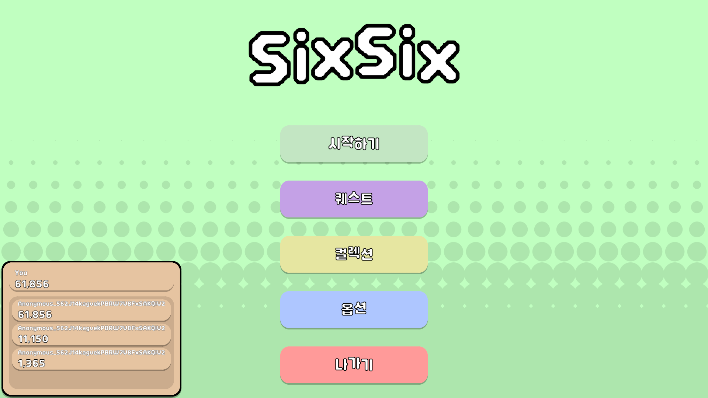
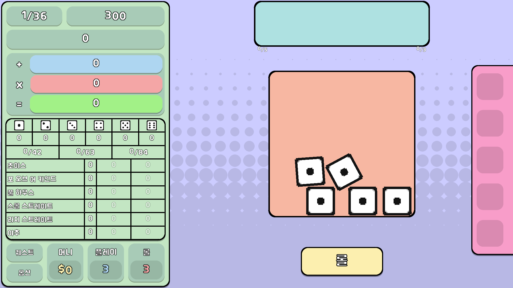
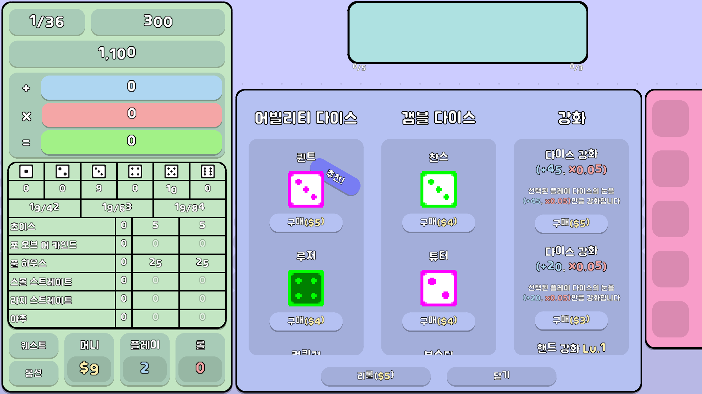
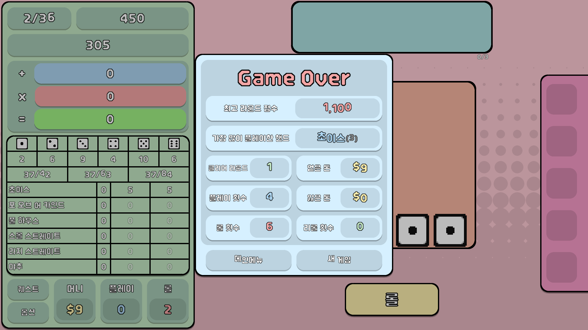
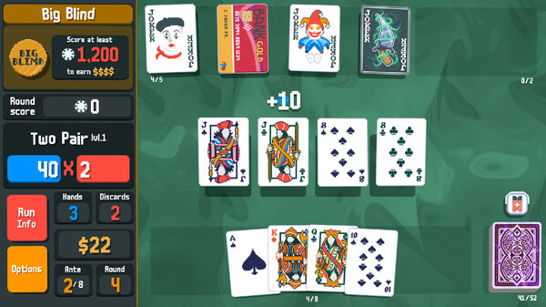
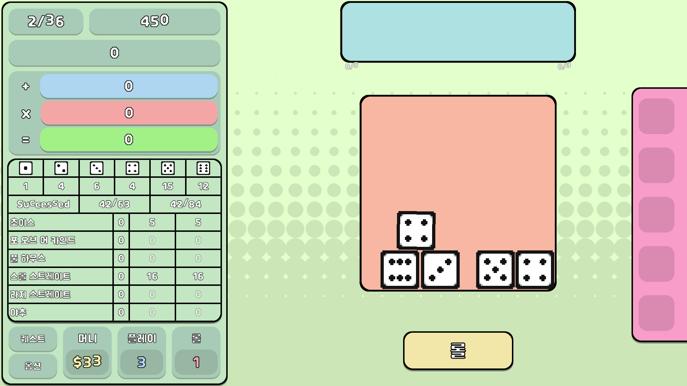
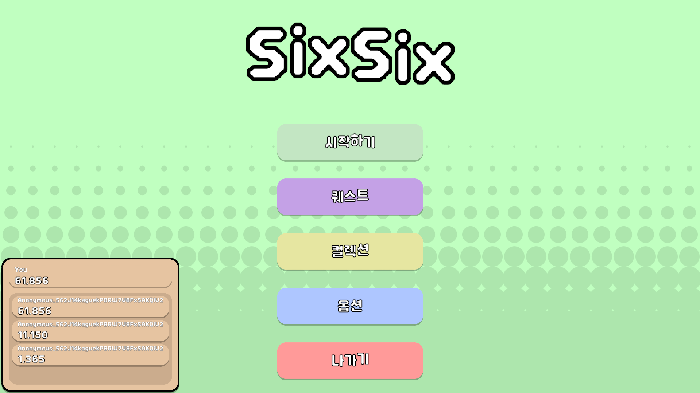
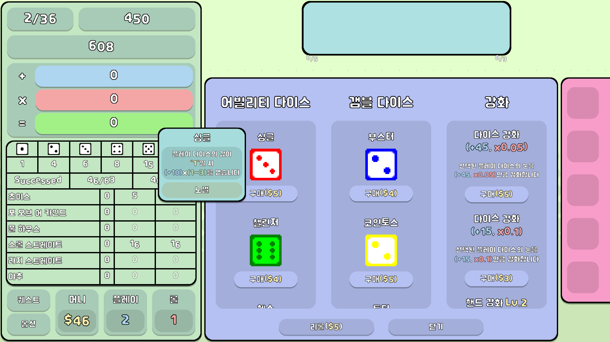
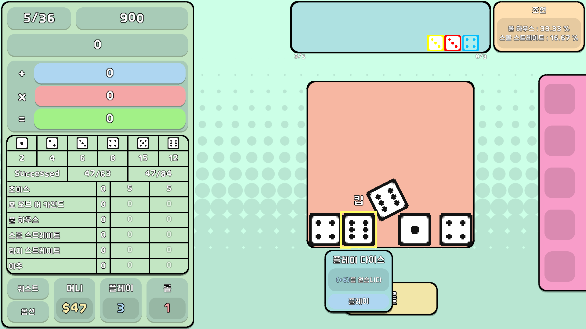
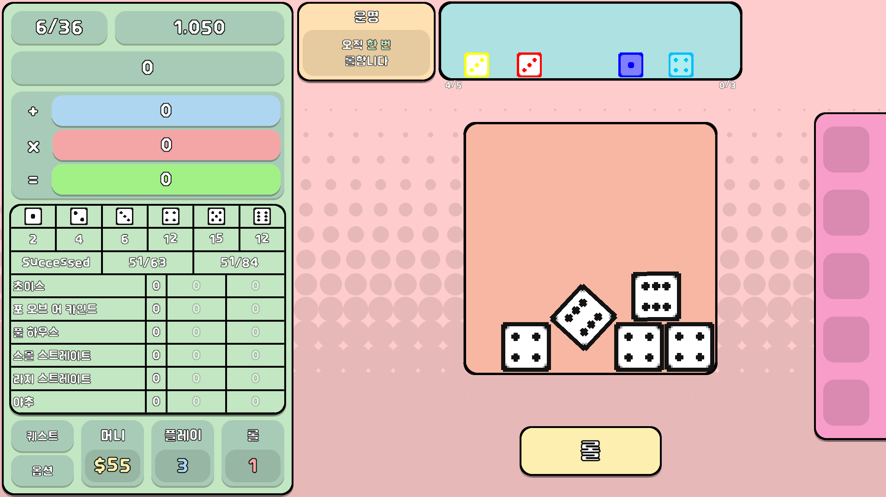

# SixSix

## 게임 설명

SixSix는 주사위를 사용한 포커 룰을 통해 점수와 재화를 획득하고, 상점에서 아이템과 강화를 통해 높은 라운드를 목표로 하는 로그 라이크 게임입니다.

SixSix는 인기 인디 게임인 Balatro와 주사위 보드 게임인 Yacht Dice에 영감을 받아 제작하게 되었습니다.

Balatro

[이미지 출처](https://www.ilovepc.co.kr/news/articleView.html?idxno=53626)

닌텐도 세계 게임전집 51의 Yacht Dice

[이미지 출처](https://blog.naver.com/doek11/222079755012)

## 게임 진행 순서

게임 시작 시 보이는 메인 메뉴 화면입니다. 메인 메뉴에서는 시작, 퀘스트, 컬렉션, 옵션, 나가기가 선택 가능하고 좌측 하단에서 점수 리더 보드를 확인할 수 있습니다.

게임 화면에서는 롤 버튼을 통해 주사위를 굴릴 수 있습니다. 굴린 주사위의 조합을 통해서 핸드를 판단하며 제출 가능한 핸드가 좌측에 점수와 함께 표시됩니다. 플레이어는 해당 점수를 클릭하는 것으로 한 번의 플레이를 소모하여 점수를 얻을 수 있습니다.

라운드를 클리어하면 상점에 진입하게 됩니다. 상점에서는 게임을 통해 획득한 머니를 사용해 점수를 얻는 데 도움을 주는 어빌리티 다이스, 갬블 다이스를 구매하거나 강화를 진행할 수 있습니다.

라운드를 진행함에 따라 달성해야 하는 점수가 계속 높아집니다. 주사위를 굴리면 현재 주사위 조합에 따라 달성 가능한 조합을 조언으로 알려줍니다. 이를 통해서 플레이어는 굴리고 싶지 않은 주사위는 ‘킵’ 기능을 통해 주사위 눈이 변경되지 않도록 할 수 있습니다.

6라운드마다 보스 라운드가 되어 플레이어는 하나의 디버프를 받고 라운드를 진행하게 됩니다. 예시에서는 각 플레이 당 최대 한 번의 롤만 가능한 디버프가 적용된 모습입니다.

## 플레이 영상
